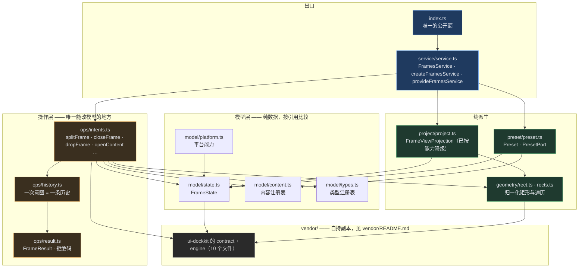
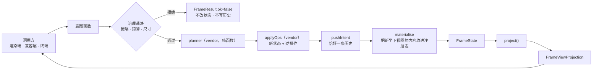
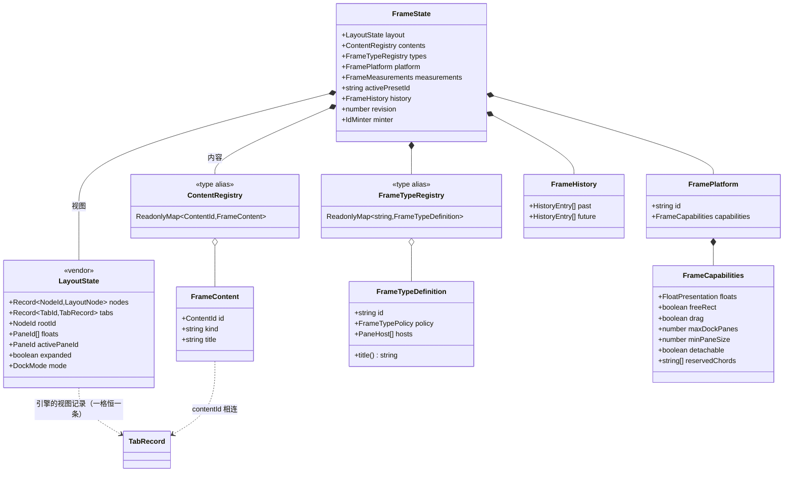
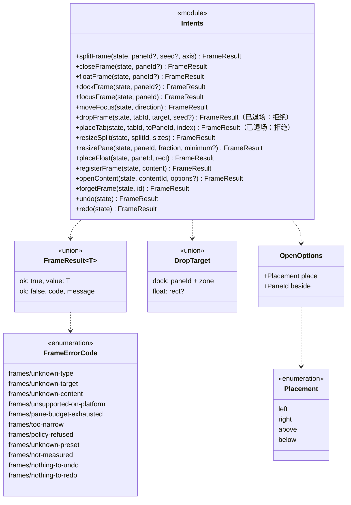
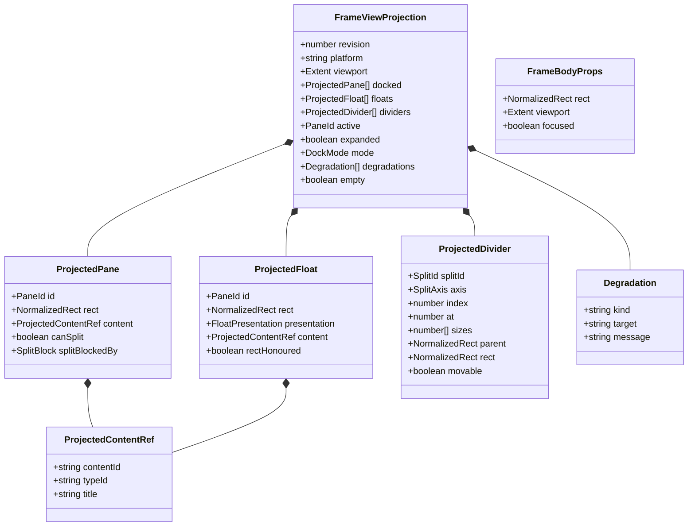
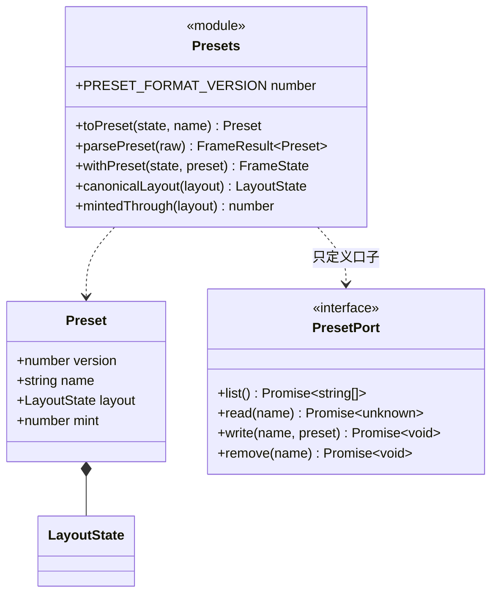
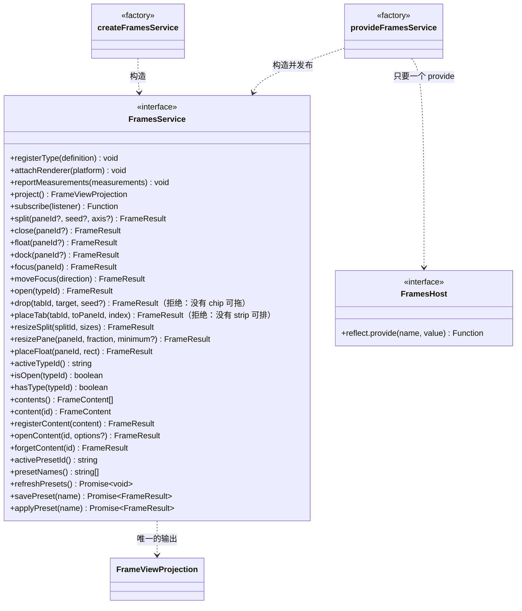

# `@deepseek-ai/dsh-client-frames` 设计

> **本包是三个仓库里的核心。** 它不认识 React、DOM、`ui-layout`，也不认识任何 legacy 概念。
> 总体的三仓关系、共享契约与跨包不变量见工作区根目录的 [`frame-manager-design.md`](../../../frame-manager-design.md)。
> 任务与进度见 [`frame-manager-tasks.md`](../../../frame-manager-tasks.md)。

---

## 1. 职责边界

| | 知道什么 | **绝不知道** |
|---|---|---|
| 本包 | frame 树、内容注册表、类型注册表、操作与历史、几何、能力降级、投影、预设 | React / DOM / `ui-layout` / `ctx.layout` / `usePanelInfo` / `main` / conversation / "sidebar" |
| 谁挂载它 | 宿主（渲染端）提供 `reflect.provide`；本包**不自己挂载** | 谁来画、画在什么上 |

**它只发布两样东西**：一个 `FramesService`（`ctx.frames`），和一个纯函数 `project()` 的产物 `FrameViewProjection`。

---

## 2. 框架图

### 2.1 内部分层



**三条方向规则**：

1. **只有 `ops/intents.ts` 改模型。** 它调 `applyOp`（vendor）拿到新状态与逆操作，再写历史。除此之外没有第二条路径。
2. **`project/` 只读。** 它把状态摊平并**就能力降级**，从不回写——同一份预设因此在两个目标上投影不同、存的却是同一份。
3. **`service/` 不决策。** 它只做三件事：把当前状态交给意图、比较新旧引用决定要不要发布、把名字发布到宿主。

### 2.2 一次操作的路径



---

## 3. 静态类图

### 3.1 状态与注册表



> **一格显示一个内容；tab 不是核心的词汇。** 引擎的 `LayoutState.tabs` 仍在（那是 vendored 模型，浮层本来就是"capacity 1 tab, drawn without a tab strip"），但本层把它**恒定为每格一条**：`PaneNode.tabs` 永远是长度 1 或 0，`moveTab`/`reorderTab` 这些 op 不再被任何意图产生。上面这一层只说 **content**：一格显示哪个内容、哪个内容被换下但还活着。
>
> **一个 content 内部有没有 tab，是它自己的插件的事**（editor 的文件页、右栏面板的页签都是这样画的）。核心既不画、也不知道，所以"同一格的 tab 混用"这种事在模型里根本不存在。

### 3.2 操作层



> **每条意图**都走同一条路：治理裁决 → planner → `applyOps` → **恰好一条历史**。被拒绝的既不改状态也不写历史，并且**不产生历史**这件事本身有测试断言。
>
> **`closeFrame` 是"删掉这一格"**：格子里显示的东西被关掉，格子本身也随之消失（非根的停靠格合并回它的兄弟）。**根格是外壳**——关它只带走它显示的东西，外壳留着（清空的那一格画选择列表）。所以"空格子关不掉"从来不是不变式，它只是 `closeFrame` 里一个写于"空 pane 只可能是外壳"年代的早退分支。
>
> **`undo` / `redo` 是布局历史**。`forgetFrame` **不记历史**——历史是布局操作的序列，销毁内容不是布局操作，撤销一次布局变更救不回一个内容。

### 3.3 投影



> `project()` 是**纯函数**，且**引用只在布局真的变了时才换**（`revision` 随之递增）。渲染端因此可以用引用比较决定要不要重画。
>
> `FrameBodyProps` 是"渲染端必须交给 body 什么"的契约：面积保持归一化，viewport 一起传，body 自己换算。终端渲染端要照做。
>
> **投影还列两本账**：`types`（注册了哪些类型、哪些**能造**、哪些**能被 frame 画**）与 `contents`（外壳握着哪些内容，同样带 `placeable`）。选择器读这两本账，所以核心不必为某个 UI 添概念；而"谁能被画"是**类型拥有者的声明**（`policy.placeable`）——一个内容的拥有者可能把它画在别处（compat 的右栏面板挂在 overlay 座位上，占位那一格画的是空盒子），把它列进选择器就是递给用户一个**空的 frame**（T25）。

### 3.4 预设



> **核心不碰介质。** `PresetPort` 是口子，介质由宿主给（web 端给的是 `localStorage`）。判断"这到底是不是一份合法预设"是核心的事，所以 `read()` 原样交回、`parsePreset()` 负责裁决。
>
> **预设不带 `contents`。** 载入时从布局里把内容重新收上来（`adoptContents`），所以格式版本仍是 v1、迁移链仍为空——用户的原话是内容"存在于**内存**中"，一次刷新是新会话。

### 3.5 服务面



> **服务不自己挂载。** `provideFramesService` 只要求宿主有一个 `reflect.provide`——这就是核心唯一的宿主依赖，也正是终端能在自己的组合里挂同一份服务的原因。

---

## 4. 不变量

1. **降级只发生在投影层，绝不回写模型。** 否则跨端预设共享立刻失效。
2. **`applyOp` 之外没有第二条修改路径**；一次语义操作 = 一条历史记录。
3. **被拒绝的操作既不写历史也不改状态**。
4. **内容的生死与帧无关**：关掉最后一个视图，内容仍在；唯一出口是 `forgetFrame`。
5. **`project()` 纯**，且引用只在布局变化时改变。

---

## 5. 测试

```sh
node tools/run-tests.ts        # 在工作区根目录
```

| 套件 | 守什么 |
|---|---|
| `vendor.test.ts` | 副本无 React、不引用自己之外的东西、出处文件列全了每个文件 |
| `registry.test.ts` | 类型注册表不可变、重复 id 是编程错误 |
| `project.test.ts` | 投影快照与降级 |
| `intents.test.ts` | 三类拒绝、撤销/重做、一次意图一条历史 |
| `float.test.ts` · `drop.test.ts` | 宿主切换、落点语义 |
| `content.test.ts` | 内容不随视图消亡 |
| `placement.test.ts` | 四个方位真的落在那一侧（断言几何，不是断言参数） |
| `resize-pane.test.ts` | 改比例的分摊与两个下限 |
| `preset.test.ts` | 逐字段往返、版本拒绝、只保存才写 |
| `capabilities.test.ts` | 24 种能力组合的投影 |
| `service.test.ts` | 服务面的发布、订阅、引用语义 |
